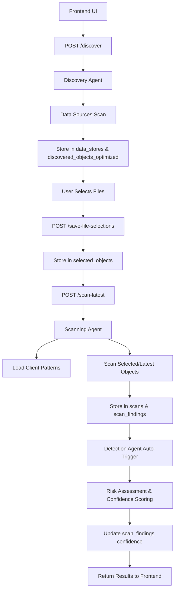

# 🔍 **Data Protection System - Complete Workflow Documentation**

## **Table of Contents**
1. [System Architecture Overview](#system-architecture-overview)
2. [Discovery Process](#1-discovery-process)
3. [Scanning Process](#2-scanning-process)
4. [Detection Process](#3-detection-process)
5. [End-to-End Workflow](#4-end-to-end-workflow)
6. [Database Schema](#database-schema)
7. [API Endpoints](#api-endpoints)
8. [Key Features](#key-features)

---

## **System Architecture Overview**

The system is a **multi-client data protection platform** with four main components:

| Component | Purpose | Key Files |
|-----------|---------|-----------|
| **Discovery Agent** | Finds and catalogs data sources | `modular_discovery_agent.py` |
| **Scanning Agent** | Scans files/databases for sensitive data | `modular_scanning_agent.py` |
| **Detection Agent** | Analyzes scan results and assigns confidence scores | `modular_detection_agent.py` |
| **Database Manager** | Handles all data persistence | `postgresql_db_manager.py` |

---

## 🔍 **1. Discovery Process**

### **Components Involved:**
- `ModularDiscoveryAgent` - Main discovery orchestrator
- `AgentConfigManager` - Manages data source configurations
- `PostgreSQLCloudScanDBManager` - Stores discovery results

### **How Discovery Works:**

#### **Step 1: Data Source Configuration**
Data sources are configured per client in the config manager:

```python
data_sources = [
    {
        "name": "BigQuery Analytics",
        "type": "bigquery", 
        "location": "project_id.dataset_name",
        "credentials": {...}
    },
    {
        "name": "GCS Data Lake", 
        "type": "gcs",
        "location": "gs://bucket-name/path/",
        "credentials": {...}
    },
    {
        "name": "Local Files",
        "type": "filesystem",
        "location": "/path/to/data",
        "credentials": null
    }
]
```

#### **Step 2: Discovery Execution**
**API Endpoint:** `POST /discover`

**Request:**
```json
{
  "client_id": "client_123",
  "location": "/path/to/data",
  "store_name": "My Data Store",
  "access_control": "read-write"
}
```

#### **Step 3: Discovery Process Flow**
1. **`discover_all_sources()`** iterates through configured data sources
2. **For each source type:**
   - **BigQuery**: Connects using service account, lists datasets/tables
   - **GCS**: Lists buckets and objects with metadata
   - **Local Files**: Scans directory structures
   - **PostgreSQL**: Connects and catalogs schemas/tables

#### **Step 4: Data Storage**
**Database Tables Updated:**

**`data_stores` Table:**
```sql
INSERT INTO data_stores (
    client_id, store_name, location, store_type, discovery_timestamp
) VALUES (
    'client_123', 'BigQuery Analytics', 'project.dataset', 'bigquery', NOW()
)
```

**`discovered_objects_optimized` Table:**
```sql
INSERT INTO discovered_objects_optimized (
    store_id, client_id, name, type, path, size_bytes, mime_type, discovered_at
) VALUES (
    1, 'client_123', 'customers.csv', 'file', '/data/customers.csv', 1024, 'text/csv', NOW()
)
```

### **Discovery Output Structure:**
```json
{
  "sources_discovered": [
    {
      "store_id": 1,
      "store_name": "BigQuery Analytics", 
      "objects_discovered": 45,
      "total_size_bytes": 1048576,
      "discovery_status": "completed"
    }
  ],
  "total_sources": 1,
  "discovery_timestamp": "2025-08-04T15:30:00Z",
  "status": "completed"
}
```

---

## 🧪 **2. Scanning Process**

### **Components Involved:**
- `ModularScanningAgent` - Main scanning orchestrator
- `PatternManager` - Loads regex patterns from database 
- Various scanners (`CSVScanner`, `BigQueryScanner`, `GCSScanner`)
- `PostgreSQLCloudScanDBManager` - Stores scan results

### **How Scanning Works:**

#### **Step 1: File Selection (Optional)**
**API Endpoint:** `POST /save-file-selections`

**Request:**
```json
{
  "client_id": "client_123",
  "scan_session_id": "session_20250804_001", 
  "selected_files": [
    {
      "file_name": "customers.csv",
      "store_id": 1,
      "path": "/data/customers.csv",
      "object_type": "file"
    },
    {
      "file_name": "employees.json",
      "store_id": 1,
      "path": "/data/employees.json",
      "object_type": "file"
    }
  ]
}
```

**Database Table Updated:**
```sql
INSERT INTO selected_objects (
    client_id, scan_session_id, object_id, store_id, 
    object_name, object_type, object_path
) VALUES (
    'client_123', 'session_20250804_001', 15, 1, 
    'customers.csv', 'file', '/data/customers.csv'
)
```

#### **Step 2: Scan Initiation**
**Available API Endpoints:**

| Endpoint | Purpose | Behavior |
|----------|---------|----------|
| `POST /scan-latest` | Scans latest database OR selected objects | Smart selection based on latest session |
| `POST /scan-all` | Scans all discovered objects | Ignores file selections |
| `POST /scan-selected-only` | Scans only pre-selected objects | Requires prior file selection |

#### **Step 3: Pattern Loading**
1. **Database-First Approach:** `PatternManager` loads regex patterns from database
2. **Client-Specific Filtering:** Only patterns for client's selected SDEs are used

**Example patterns loaded:**
```python
patterns = {
    "email_patterns": [r'\b[A-Za-z0-9._%+-]+@[A-Za-z0-9.-]+\.[A-Za-z]{2,}\b'],
    "phone_patterns": [r'\b\d{10}\b'],
    "ssn_patterns": [r'\b\d{3}-\d{2}-\d{4}\b'],
    "credit_card_patterns": [r'\b\d{4}[\s-]?\d{4}[\s-]?\d{4}[\s-]?\d{4}\b']
}
```

#### **Step 4: Scanning Execution**
**For each selected/discovered object:**
1. **File Type Detection** - Determines scanner type (CSV, JSON, BigQuery, etc.)
2. **Content Scanning** - Applies regex patterns to actual data content
3. **Field Name Matching** - Matches column/field names to known PII patterns
4. **Finding Generation** - Creates finding records for matches

#### **Step 5: Scan Results Storage**
**Database Tables Updated:**

**`scans` Table:**
```sql
INSERT INTO scans (
    client_id, store_id, scan_type, status, started_at, completed_at
) VALUES (
    'client_123', 1, 'selective', 'completed', NOW(), NOW()
)
```

**`scan_findings` Table:**
```sql
INSERT INTO scan_findings (
    scan_id, client_id, store_id, object_id, 
    data_type, field_name, sample_value, 
    detection_method, confidence_score, risk_level
) VALUES (
    101, 'client_123', 1, 15,
    'email', 'customer_email', 'john@*****.com', 
    'regex_match', 0.95, 'HIGH'
)
```

### **Scanning Output Structure:**
```json
{
  "scan_results": [
    {
      "scan_id": 101,
      "store_id": 1,
      "total_findings": 1247,
      "findings_by_type": {
        "email": 523,
        "phone": 445, 
        "ssn": 279
      },
      "scan_duration_seconds": 45.2,
      "status": "completed"
    }
  ],
  "total_objects_scanned": 12,
  "total_findings": 1247
}
```

---

## 🕵️ **3. Detection Process**

### **Components Involved:**
- `ModularDetectionAgent` - Main detection orchestrator
- Risk assessment algorithms
- Anomaly detection logic
- `PostgreSQLCloudScanDBManager` - Updates confidence scores

### **How Detection Works:**

#### **Step 1: Automatic Trigger**
Detection runs **automatically** after scanning completes:

```python
# In scan-latest endpoint 
if scan_results:
    detection_agent = ModularDetectionAgent(client_id=request.client_id)
    for scan_result in scan_results['scan_results']:
        scan_id = scan_result.get('scan_id')
        analysis_results = detection_agent.analyze_scan_findings(scan_id)
```

#### **Step 2: Analysis Methods**
1. **Risk Level Assessment** - Categorizes findings by sensitivity
2. **Confidence Score Calculation** - Uses multiple factors:
   - Pattern match strength
   - Context analysis
   - Field name correlation
   - Data validation
3. **Anomaly Detection** - Identifies unusual patterns:
   - High concentration of PII in unexpected files
   - Unusual field naming patterns
   - Data format inconsistencies

#### **Step 3: Risk Assessment Logic**
```python
def _assess_risk_levels(self, findings):
    risk_assessment = {
        'critical_findings': 0,
        'high_risk_findings': 0, 
        'medium_risk_findings': 0,
        'low_risk_findings': 0,
        'overall_risk': 'low',
        'risk_factors': []
    }
    
    for finding in findings:
        if finding.get('risk_level') == 'CRITICAL':
            risk_assessment['critical_findings'] += 1
        elif finding.get('risk_level') == 'HIGH':
            risk_assessment['high_risk_findings'] += 1
        # ... continue for all risk levels
    
    # Determine overall risk
    if risk_assessment['critical_findings'] > 0:
        risk_assessment['overall_risk'] = 'critical'
    elif risk_assessment['high_risk_findings'] > 5:
        risk_assessment['overall_risk'] = 'high'
    # ... continue logic
    
    return risk_assessment
```

#### **Step 4: Confidence Score Updates**
**Database Table Updated:**
```sql
UPDATE scan_findings 
SET confidence_score = 0.87, updated_at = NOW()
WHERE finding_id = 12345
```

### **Detection Output Structure:**
```json
{
  "detection_results": [
    {
      "scan_id": 101,
      "total_findings": 1247,
      "confidence_updates": 1247,
      "analysis_summary": {
        "overall_risk": "high",
        "critical_findings": 15,
        "high_risk_findings": 234,
        "anomalies_detected": 3,
        "recommendations": [
          "Encrypt critical PII fields immediately",
          "Implement data masking for development environments"
        ]
      }
    }
  ]
}
```

---

## 🔁 **4. End-to-End Workflow**

### **Complete Process Flow:**



### **Step-by-Step Execution:**

#### **Step 1: Initial Discovery**
```bash
POST /discover
{
  "client_id": "client_123",
  "location": "gs://my-bucket/data/",
  "store_name": "Production Data Lake"
}
```
**→ Discovers 1,250 files → Stores in `data_stores` + `discovered_objects_optimized`**

#### **Step 2: File Selection (Optional)**
```bash
POST /save-file-selections  
{
  "client_id": "client_123",
  "scan_session_id": "session_001",
  "selected_files": [...]
}
```
**→ Stores 15 selected files in `selected_objects`**

#### **Step 3: Scanning**
```bash
POST /scan-latest
{
  "client_id": "client_123" 
}
```
**→ Checks `selected_objects` → Scans 15 files → Finds 347 PII instances → Stores in `scan_findings`**

#### **Step 4: Auto-Detection**  
**→ Analyzes 347 findings → Updates confidence scores → Categorizes risks**

#### **Step 5: Results**
```json
{
  "status": "success",
  "scan_type": "latest_database_selective",
  "selective_scan_used": true,
  "results": {
    "total_findings": 347,
    "scan_duration": "23.4s"
  },
  "detection_results": {
    "confidence_updates": 347,
    "overall_risk": "medium"
  }
}
```

---

## **Database Schema**

### **Core Tables:**

#### **1. `data_stores` - High-level data source catalog**
```sql
CREATE TABLE data_stores (
    store_id SERIAL PRIMARY KEY,
    client_id VARCHAR(255) NOT NULL,
    store_name VARCHAR(255) NOT NULL,
    location TEXT NOT NULL,
    store_type VARCHAR(100),
    discovery_timestamp TIMESTAMP DEFAULT NOW(),
    access_control VARCHAR(50)
);
```

#### **2. `discovered_objects_optimized` - Individual files/objects inventory**
```sql
CREATE TABLE discovered_objects_optimized (
    object_id SERIAL PRIMARY KEY,
    store_id INTEGER NOT NULL,
    client_id VARCHAR(255) NOT NULL,
    name VARCHAR(500) NOT NULL,
    type VARCHAR(100) NOT NULL,
    path TEXT,
    size_bytes BIGINT DEFAULT 0,
    mime_type VARCHAR(255),
    discovered_at TIMESTAMP DEFAULT NOW()
);
```

#### **3. `selected_objects` - User file selections for scanning**
```sql
CREATE TABLE selected_objects (
    selection_id SERIAL PRIMARY KEY,
    client_id VARCHAR(255) NOT NULL,
    scan_session_id VARCHAR(255) NOT NULL,
    object_id INTEGER,
    store_id INTEGER NOT NULL,
    object_name VARCHAR(500),
    object_type VARCHAR(100),
    object_path TEXT,
    selected_at TIMESTAMP DEFAULT NOW()
);
```

#### **4. `scans` - Scan execution metadata**
```sql
CREATE TABLE scans (
    scan_id SERIAL PRIMARY KEY,
    client_id VARCHAR(255) NOT NULL,
    store_id INTEGER,
    scan_type VARCHAR(100),
    status VARCHAR(50),
    started_at TIMESTAMP DEFAULT NOW(),
    completed_at TIMESTAMP,
    total_objects_scanned INTEGER,
    total_findings INTEGER
);
```

#### **5. `scan_findings` - Individual PII/sensitive data findings**
```sql
CREATE TABLE scan_findings (
    finding_id SERIAL PRIMARY KEY,
    scan_id INTEGER NOT NULL,
    client_id VARCHAR(255) NOT NULL,
    store_id INTEGER,
    object_id INTEGER,
    data_type VARCHAR(100),
    field_name VARCHAR(255),
    sample_value TEXT,
    detection_method VARCHAR(100),
    confidence_score DECIMAL(3,2),
    risk_level VARCHAR(50),
    scan_timestamp TIMESTAMP DEFAULT NOW()
);
```

#### **6. `sdes` - Master SDE pattern definitions**
```sql
CREATE TABLE sdes (
    sde_id SERIAL PRIMARY KEY,
    name VARCHAR(255) NOT NULL,
    data_type VARCHAR(100),
    sensitivity VARCHAR(50),
    regex TEXT,
    protection_method VARCHAR(100),
    classification_level VARCHAR(50),
    industry VARCHAR(100),
    description TEXT
);
```

#### **7. `client_selected_sdes` - Client-specific SDE selections**
```sql
CREATE TABLE client_selected_sdes (
    selection_id SERIAL PRIMARY KEY,
    client_id VARCHAR(255) NOT NULL,
    sde_id INTEGER NOT NULL,
    selected_at TIMESTAMP DEFAULT NOW()
);
```

### **Data Flow Through Tables:**
```
Discovery: data_stores ← discovered_objects_optimized
Selection: selected_objects  
Scanning: scans ← scan_findings
Detection: scan_findings (confidence updates)
```

---

## **API Endpoints**

### **Discovery Endpoints**
| Endpoint | Method | Purpose |
|----------|--------|---------|
| `/discover` | POST | Discover data sources for a client |
| `/discover-all-missing` | POST | Discover all missing data sources |

### **Scanning Endpoints**
| Endpoint | Method | Purpose |
|----------|--------|---------|
| `/scan-latest` | POST | Smart scan (latest DB or selected objects) |
| `/scan-all` | POST | Scan all discovered objects |
| `/scan-specific` | POST | Scan specific database/store |
| `/scan-selected-only` | POST | Scan only pre-selected objects |

### **File Selection Endpoints**
| Endpoint | Method | Purpose |
|----------|--------|---------|
| `/save-file-selections` | POST | Save file selections for scanning |
| `/save-selection` | POST | Alternative file selection endpoint |
| `/clear-selections` | POST | Clear file selections |

### **Data Retrieval Endpoints**
| Endpoint | Method | Purpose |
|----------|--------|---------|
| `/check-selected-objects` | GET | Check selected objects for client |
| `/discovered-objects` | GET | Get discovered objects |
| `/data-stores` | GET | Get data stores for client |

### **SDE Management Endpoints**
| Endpoint | Method | Purpose |
|----------|--------|---------|
| `/client-sdes` | POST | Manage client SDE selections |
| `/available-sdes` | GET | Get available SDE patterns |

### **Pipeline Endpoints**
| Endpoint | Method | Purpose |
|----------|--------|---------|
| `/run-pipeline` | POST | Execute full discovery→scan→detect pipeline |

---

## **Key Features**

### **Multi-Client Architecture:**
- All operations are scoped by `client_id`
- Each client has independent data stores, selections, and findings
- Client-specific SDE pattern filtering

### **Flexible Scanning Options:**
| Scan Type | Behavior | Use Case |
|-----------|----------|----------|
| **Full Discovery Scan** | Scans all discovered objects | Initial comprehensive scan |
| **Selective Scan** | Scans only user-selected files | Targeted scanning |
| **Latest Database Scan** | Intelligently chooses based on selections | Regular monitoring |

### **Database-First Design:**
- Patterns loaded from database (not YAML files)
- Client-specific pattern filtering
- Real-time pattern updates
- Centralized SDE management

### **Progressive Enhancement:**
- Discovery → Selection → Scanning → Detection
- Each step builds on the previous
- Automatic confidence scoring and risk assessment

### **Smart Selection Logic:**
```python
# scan-latest endpoint logic
if has_selected_objects_in_latest_session:
    scan_selected_objects()
else:
    scan_latest_database()
```

### **Session Management:**
- Each file selection creates a unique `scan_session_id`
- Latest session takes precedence
- Prevents accumulation of old selections

### **Confidence Scoring:**
- Automatic after each scan
- Multi-factor analysis:
  - Pattern match strength
  - Context validation
  - Field name correlation
  - Data format consistency

---

## **System Characteristics**

### **Performance Features:**
- Batch processing for large datasets
- Optimized database queries with indexes
- Connection pooling for database operations
- Asynchronous scanning for multiple files

### **Security Features:**
- Client isolation and multi-tenancy
- Sample value masking in findings
- Encrypted credential storage
- Access control validation

### **Scalability Features:**
- Modular agent architecture
- Database-driven configuration
- Horizontal scaling support
- Cloud-native deployment ready

This architecture provides a scalable, multi-tenant data protection platform with comprehensive discovery, scanning, and detection capabilities suitable for enterprise data governance requirements.
